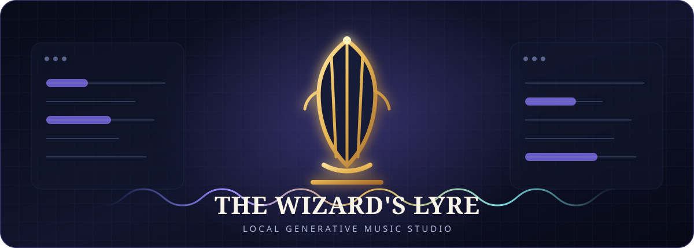

<p align="center">
  
</p>

<h1 align="center">The Wizard's Lyre</h1>

<p align="center">
  Shape music on your own GPU. Keep every take. Send nothing to the cloud.
</p>

<p align="center">
  <a href="https://github.com/wizards-ecosystem/wizards-lyre/actions/workflows/ci.yml"></a>
  <a href="https://github.com/wizards-ecosystem/wizards-lyre/actions/workflows/codeql.yml"></a>
  <a href="https://github.com/wizards-ecosystem/wizards-lyre/releases/latest"></a>
  <a href="LICENSE"></a>
  <a href="pyproject.toml"></a>
  
</p>

<p align="center">
  <a href="docs/INSTALLATION.md">Install</a> |
  <a href="#the-studio-loop">Studio loop</a> |
  <a href="docs/TROUBLESHOOTING.md">Troubleshoot</a> |
  <a href="CONTRIBUTING.md">Contribute</a>
</p>

Lyre is a local, human-guided generative music studio powered by
[ACE-Step 1.5][acestep]. There are no accounts, API keys, subscriptions, or
cloud music services. After setup, generation stays on your machine.

Each song is a project with an editable composition plan, an immutable lineage
of takes, and a waveform you can select and reshape. Throw a seed, listen, keep
what works, and push it somewhere new.

| Compose | Transform | Finish |
|---|---|---|
| Start from a simple idea or write the caption, lyrics, BPM, key, meter, sections, and duration yourself. | Cover a take, repaint a selected region, isolate a track, add or replace an instrument, or complete an arrangement. | Compare takes A/B, score and annotate them, restore any earlier take, train a style pack, and export a DAW-ready archive. |

> **Status: Working.** All six implementation phases in [SPEC.md](SPEC.md) are
> built. Version 0.1.0 is the first public release candidate. Missing FFmpeg
> stops style-pack LoRA training; generation remains available.

## Quick start

The supported path is Linux x86-64 or Windows 11 with WSL2, an NVIDIA GPU,
`git`, and [`uv`][uv]. The defaults are tuned for 16 GB VRAM. A full setup
needs at least 55 GB free before space for your music.

For the smallest download, get the `.tar.gz` or `.zip` runtime bundle from the
[latest release](https://github.com/wizards-ecosystem/wizards-lyre/releases/latest),
extract it, and run:

```bash
./scripts/lyre bootstrap
./scripts/lyre doctor
```

Release bundles include the compiled studio UI, so they do not need Node.js,
npm, the test suite, or contributor documentation. They fetch the pinned
ACE-Step source and model weights during setup; those large upstream artifacts
are not redistributed in the download.

To work from source instead, install Node.js 20.19+ or 22.12+ and clone the
repository:

```bash
git clone https://github.com/wizards-ecosystem/wizards-lyre.git
cd wizards-lyre
./scripts/lyre bootstrap
./scripts/lyre doctor
```

`bootstrap` creates a local Python environment, installs the pinned ACE-Step
source, prepares the web app, and downloads every model profile. It is
resumable. For a smaller start, install only the default generation models:

```bash
./scripts/lyre install
./scripts/lyre models-core
```

See the [installation guide](docs/INSTALLATION.md) for archive verification,
prerequisites, WSL2, model footprints, updating, backups, and the GPU-free
developer setup.

Start two processes in separate terminals:

```bash
./scripts/lyre server   # API + built SPA at 127.0.0.1:8421
```

```bash
./scripts/lyre worker   # the only process that loads CUDA
```

Then open <http://127.0.0.1:8421>.

The split is deliberate: generation never blocks the API, a GPU failure does
not take down the server, and jobs posted while the worker is stopped wait in
the local SQLite queue.

## The studio loop

```text
idea -> plan -> generate -> listen -> keep / branch / reshape -> export
                    `-------- immutable take history --------'
```

- **Generate:** Simple mode lets ACE-Step's 5 Hz planner expand a natural
  language seed. Custom mode gives you direct control over the composition.
- **Cover / Repaint:** Remix a source or drag across the waveform to rewrite
  only that region.
- **Extract / Lego / Complete:** Isolate a track, add or replace one, or fill
  an arrangement using the base checkpoint.
- **Style packs:** Train and apply a LoRA from at least eight of your own takes.
  FFmpeg is required for training; generation works without it.
- **Traceable iteration:** Every generated take is immutable and points to its
  parent. Ratings, favorites, and notes remain yours to change.
- **Local library:** Search projects, ingest WAV/MP3 sources, compare A/B, use
  keyboard shortcuts, watch loudness, and export a complete zip.

The four model profiles trade speed, detail, memory, and editing capability.
The default `iterate` profile uses the 2B turbo checkpoint; the optional 4B
`quality` profile needs CPU offload on a 16 GB card. See
[Configuration](docs/CONFIGURATION.md) for the exact map.

## Local means local

```text
Browser ----> FastAPI server ----> SQLite + project files
                       ^
                       `-------- dedicated ACE-Step GPU worker
```

Only installation downloads packages, the pinned upstream source, and model
weights. Runtime inference does not call an external music API. Writable state
is kept under the checkout; `./scripts/lyre paths` shows every location.

Lyre binds to `127.0.0.1` and intentionally has no authentication. Never expose
it through port forwarding, a reverse proxy, or a public bind. Read the
[security policy](SECURITY.md) before changing that boundary.

## Documentation

| Guide | What it answers |
|---|---|
| [Installation](docs/INSTALLATION.md) | Prerequisites, model sizes, WSL2, first run, updates, and backups |
| [Architecture](docs/ARCHITECTURE.md) | Process boundaries, queue leases, storage, and failure recovery |
| [Configuration](docs/CONFIGURATION.md) | Every `LYRE_*` setting and all DiT profiles |
| [HTTP API](docs/API.md) | Stable routes and request/response shapes; live OpenAPI is at `/docs` |
| [Troubleshooting](docs/TROUBLESHOOTING.md) | Worker startup, missing weights, VRAM, FFmpeg, and stuck jobs |
| [Live stack test](docs/LIVE_STACK_TEST.md) | End-to-end verification against real weights and a real GPU |
| [Contributing](CONTRIBUTING.md) | GPU-free setup, project scope, test loop, and pull requests |
| [Support](SUPPORT.md) | Where to ask for help and what diagnostics to include |
| [Release guide](docs/RELEASING.md) | Reproducible, security, browser, and GPU release gates |
| [Dependency audit](docs/SECURITY_AUDIT.md) | ACE-Step overlay and reachability-reviewed advisory exceptions |

`SPEC.md` is the sole product specification and the authority when any other
document disagrees.

## Development

You do not need a GPU to work on Lyre. The mock worker writes silent WAV files
while exercising the same server/UI contract:

```bash
LYRE_WORKER=mock ./scripts/lyre worker
./scripts/lyre server
./scripts/lyre web
```

The ordinary quality gate is GPU-free:

```bash
./scripts/lyre test        # pytest against the mocked worker
./scripts/lyre test-web    # Vitest + Testing Library against a mocked API
./scripts/lyre lint        # Ruff, mypy, TypeScript, ESLint, Prettier, REUSE, ShellCheck
./scripts/lyre audit       # installed Python environment + frontend lockfile
```

Real-GPU checks are manual and isolated in `smoke-gpu` and `live-check`. Please
read [CONTRIBUTING.md](CONTRIBUTING.md) and the
[Code of Conduct](CODE_OF_CONDUCT.md) before opening a pull request.

## License and responsible use

Lyre is free and open-source software under the [MIT License](LICENSE).
ACE-Step source and model artifacts are fetched separately, retain their own
notices, and are not redistributed by this repository. See
[Third-party notices](THIRD_PARTY_NOTICES.md) for the exact boundaries and
machine-readable licensing information.

You are responsible for having the rights needed for audio and lyrics you
upload or use to train a style pack, and for evaluating generated music before
publishing or commercial use. Lyre does not upload, license, or clear that
material for you.

[acestep]: https://github.com/ace-step/ACE-Step-1.5
[uv]: https://docs.astral.sh/uv/
